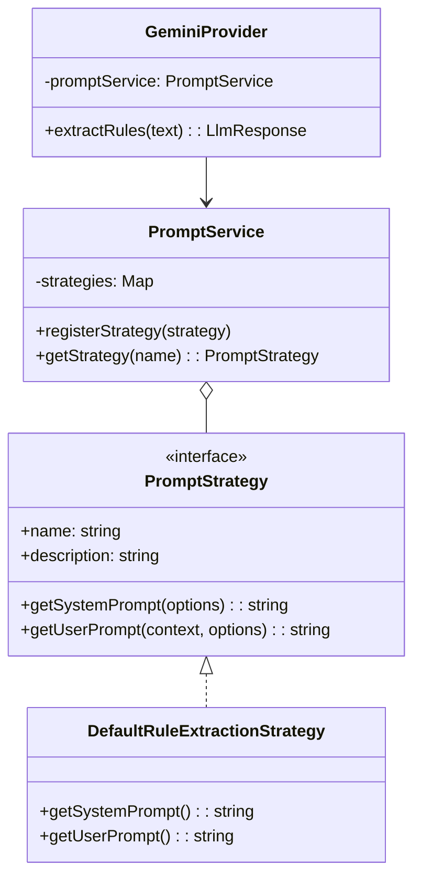

# 🧠 Engine de Regras e Conhecimento - InvestIA

Este documento detalha o funcionamento técnico da **Engine de Regras** do InvestIA, responsável por ingerir conhecimento (PDFs, Textos) e transformá-lo em regras executáveis de investimento.

## 1. Arquitetura de Prompts Modulares

Para permitir flexibilidade na interação com LLMs (Gemini, OpenAI), o sistema utiliza uma **Arquitetura de Estratégias de Prompt**. Isso desacopla a *lógica de negócio do prompt* da *lógica de conexão com o Provider*.

### 1.1 Diagrama de Classes



### 1.2 Como adicionar um novo "Modo de Análise"

1.  Crie uma nova classe em `src/modules/knowledge-base/services/prompts/` implementando `PromptStrategy`.
    *   Ex: `BarsiAnalysisStrategy`.
2.  Defina o `name` único da estratégia (ex: `'BARSI_ANALYSIS'`).
3.  Implemente `getSystemPrompt` com as instruções específicas (Persona, Regras, Formato de Saída).
4.  Registre a nova estratégia no `PromptService`.

---

## 2. Estrutura de Regras (Standardized Schema)

Todas as regras extraídas pelo LLM devem seguir um esquema rigoroso para garantir execução determinística.

### Categories
As regras são classificadas em:
*   `valuation`: P/L, P/VP, EV/EBITDA.
*   `profitability`: ROE, Margem Líquida.
*   `debt`: Dívida Líquida/EBITDA, Liquidez.
*   `dividend`: Dividend Yield, Payout.
*   `growth`: CAGR Receita/Lucros.
*   `quality`: Governança, Gestão.
*   `check`: Checagens binárias (ex: "Tem auditoria?").

### JSON Schema (Saída do LLM)
```json
{
  "rules": [
    {
      "type": "quantitative", // ou "qualitative"
      "category": "valuation",
      "indicator": "P/L", // Nome padronizado
      "operator": "<",    // <, >, <=, >=, =, between
      "value": 10,        // Numérico (decimal para %)
      "valueMax": 15,     // Obrigatório se operator="between"
      "unit": "x",
      "description": "Explicação em PT-BR",
      "confidence": 0.95  // 0.0 a 1.0
    }
  ]
}
```

---

## 3. Fluxo de Ingestão (Knowledge Base)

1.  **Upload**: Usuário envia PDF.
2.  **Extração de Texto**: `PdfExtractorService` converte PDF em string limpa.
3.  **Seleção de Estratégia**: Sistema escolhe a `PromptStrategy` (hoje `DefaultRuleExtractionStrategy`).
4.  **Inferência LLM**: `GeminiProvider` envia o prompt + texto para o modelo.
5.  **Parsing & Validação**:
    *   JSON é parseado.
    *   Regras quantitativas são validadas (existência de `value`, `operator`).
    *   Regras de baixa confiança (< 0.5) são descartadas.
6.  **Persistência**: Regras salvas no banco associadas à Filosofia.

---

## 4. Resolução de Conflitos (Roadmap)

Para suportar múltiplos arquivos por filosofia, o sistema implementará um fluxo de detecção de ambiguidade:

1.  **AmbiguityCheckStrategy**: Um prompt específico que recebe [Regras Antigas] + [Regras Novas].
2.  **Detecção**: A IA identifica se a Nova Regra contradiz a Antiga (ex: "P/L < 10" vs "P/L > 15").
3.  **UI de Resolução**: O usuário decide qual regra prevalece.

## 5. Guia de Manutenção

### Atualizar o Prompt Padrão
Edite `src/modules/knowledge-base/services/prompts/default-rule-extraction.strategy.ts`.
*   **Dica**: Ao alterar o JSON de saída, lembre-se de atualizar também a interface `ExtractedRule` no frontend e backend.

### Trocar de Modelo LLM
Edite `.env`:
```env
GEMINI_MODEL=gemini-1.5-pro # Para maior raciocínio
GEMINI_MODEL=gemini-1.5-flash # Para velocidade/custo
```
O código já suporta qualquer modelo da família Gemini.
